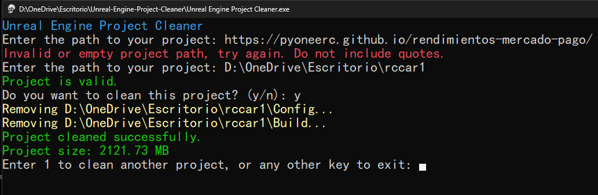

# Unreal Engine Project Cleaner

Unreal Engine Project Cleaner is a PowerShell script designed to `clean up your Unreal Engine project folder`. It `automates the process of deleting intermediate, saved, and binaries folders`, as well as Visual Studio solution and project files, helping you maintain a clean and efficient development environment.
## Features

- Detects Unreal Engine projects automatically.
- Deletes intermediate, saved, and binaries folders, among others useless folders.
- Easy to use.

## Usage

1. Download and open the .exe file.
2. Enter the path to your Unreal Engine project folder.
3. Confirm deletion.
4. Done!

## Contributing

Contributions are welcome! For major changes, please open an issue first to discuss what you would like to change.

## License

This project is licensed under the [MIT](https://choosealicense.com/licenses/mit/) license.